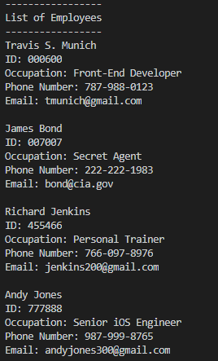

# Overview
CardDesigner is a command-line program for employers looking to print out business cards for their employees. 
You can store and manipulate basic employee information like name, title, phone number, and email--this is all done with 
Firebase. Once the information is in the database, you move on to the business card menu, where you design and download
the cards by simply entering an employee ID number. The image manipulation is done with Pillow.

# Environment
* Pillow via PIP install
* firebase_admin via PIP install
* You must set up a Firestore database and put the serviceAccountKey.json file in your directory.
* Python 3.8

# Execution

* Hit Run, and you will be welcomed by the main menu.  
\

\
* Once you've added the employee to Firebase, you can view all of your employees.  
\

\
* Here is what it looks like on Firebase (it's one collection called "employees" with a document for each employee):  
\

\
* And finally, to print an employee's business card, go to the designer menu, where you can also change style attributes like border width, font, color.  
\

\
* It will download the card to your main directory, and from there you can do what you will with it. 
\ 

\
* Here is another example: 
\ 

\
* If you'd like to modify an employee's information, go to the Update Employee menu. 
\ 

# Useful Websites
* [Firebase documentation](https://firebase.google.com/docs/guides)
* [Pillow documentation](https://pillow.readthedocs.io/en/stable/)
